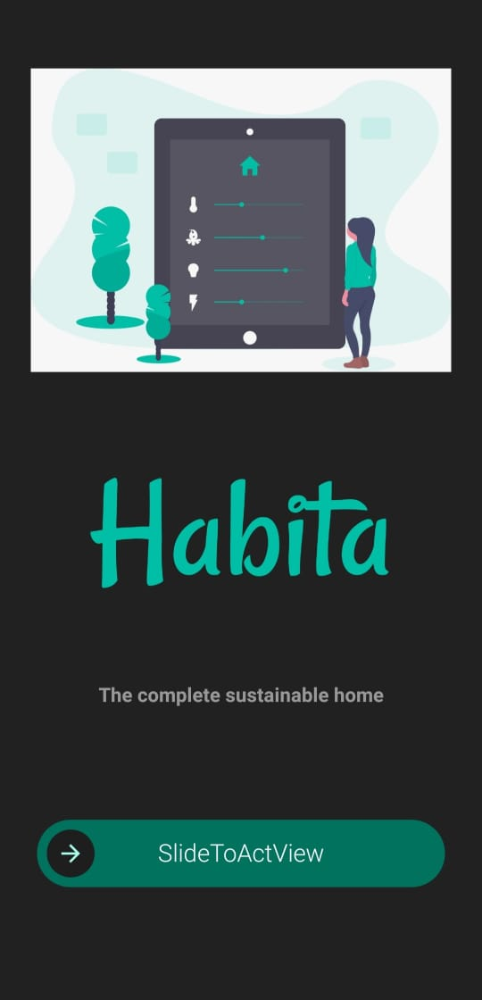
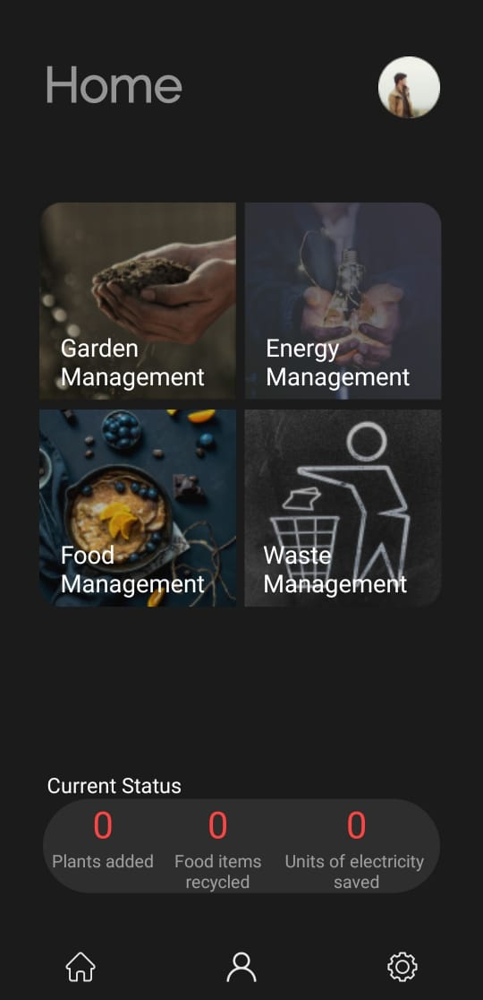
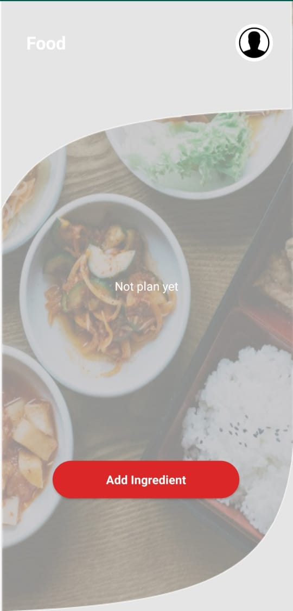
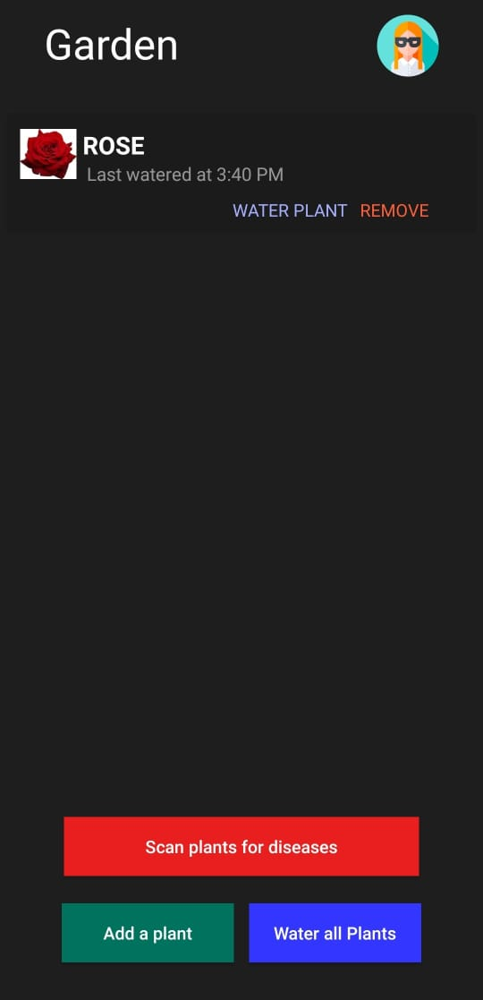
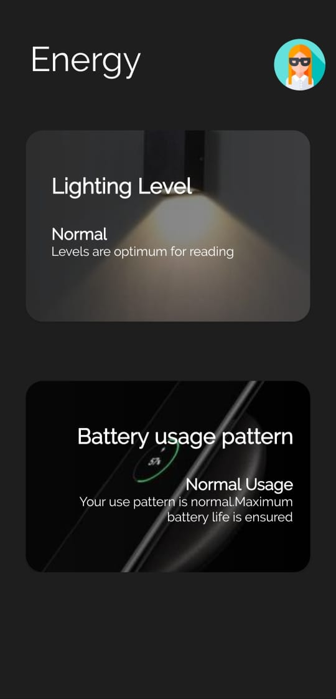

# habita-android 
Project Habita is basically an app that helps us to use products sustainably and use them in the best possible way. In this project, we will be mainly focusing on household things with the help of which we can support sustainable development - food , electricity, and plants. 
We will have different sections in the app namely food , garden and  energy sections. 
🌟In the **food** section, we will scan the picture of the food to get information about the probable ingredients and then suggest new recipes from those ingredients. 
🌟The **garden** section will be used to gather information about the diseases a plant might have and we will also have a schedule for watering plants.All the information will be gathered just by scanning  the plants. 
🌟The **energy** section would be used to optimize the lighting conditions in a room so that it can provide optimal results in low cost. 
The app will notify to readjust the light if required according to the light outside and according to the light required to do a particular task .For example, we would need more light while reading as compared to most of the other chores. Hence we should readjust the intensity of the light to the maximum while reading. 
<h2> Screenshots</h2> 

  
   
  
   
  

<h2>Requirements</h2> 
Minimum Android SDK: Habita requires a minimum API level of 23. 
Compile Android SDK: Habita requires you to compile against API 29 or later.

<h2>  License</h2> 
The MIT License (MIT)
<h2>  Contributors</h2> 

Made with [contributors-img](https://contributors-img.web.app). 
###### ❤️ Thanks to our awesome contributors.
